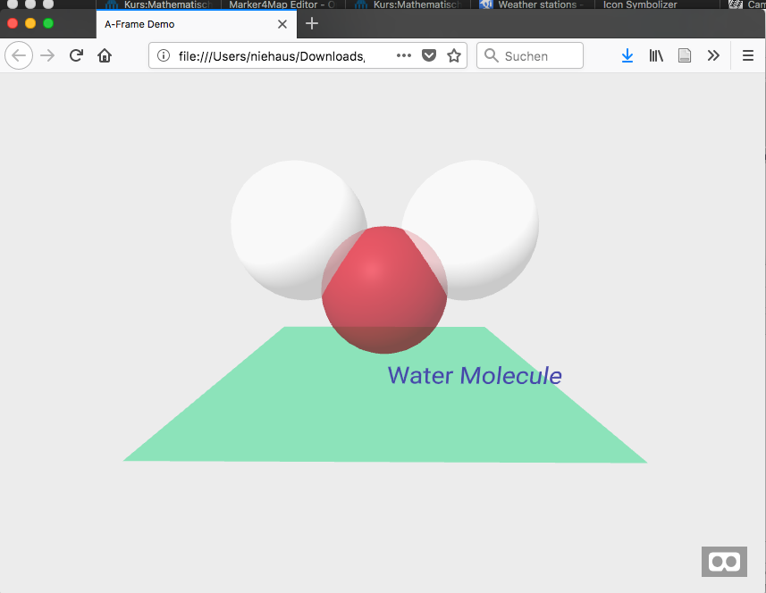
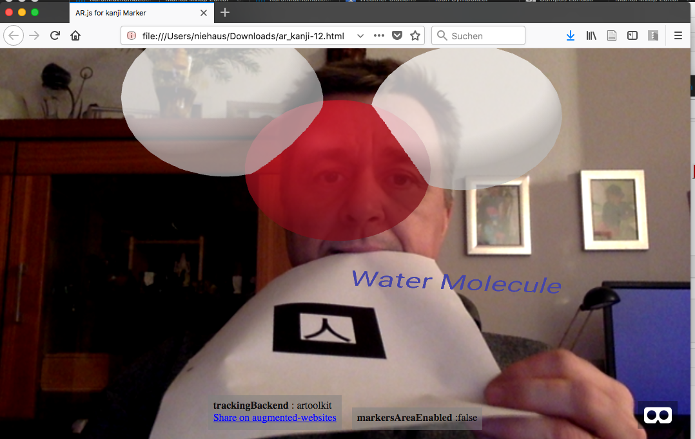

# SamplesAR
This repository contains AFrame and AR.js examples used in Wikiversity as Learning resource. The following examples are created with [JSON3D4Aframe](https://niebert.github.io/JSON3D4Aframe/index.html).

The following example shows a screenshot with a Marker in the camera image and the mixed reality with the 3D water molecule.

## Molecule Models
Molecule Models can be turn and viewed from all sides. With AR.js you need to place the specified marker in the camera image
* [Molecule Model Water - AFrame 3D Model](https://niebert.github.io/SampleAR/water_aframe.html) create with [JSON3D4Aframe](https://niebert.github.io/JSON3D4Aframe/index.html) this 3D-Model does not need mobile phone camera or marker to viewing the 3D model.
* [Molecule Model Water - Kanji-Marker](https://niebert.github.io/SampleAR/water_hiro.html) place a printed paper version of the  [Kanji-Marker](https://github.com/artoolkit/artoolkit5/blob/master/doc/patterns/Kanji%20pattern.pdf) in front of you mobile phone camera or webcam. Size of print-out 6cm x 6cm of black box.
* Created with [JSON3D4Aframe](https://niebert.github.io/JSON3D4Aframe)

## 360 Degree images
* [Example 360o Panorama](https://niebert.gihub.io/SampleAR/durlach_saumarkt.html) provided in this repository.
* 360o Panorama created with [HuginSample](https://www.github.com/niebert/HuginSample).
* [AFrame Demo]() this 360o Panorama is based on
This repository provides a sample image source for the Panorama photo stitcher - [Hugin](http://hugin.sourceforge.net/download/).
* People that want to learn about creating [360 degree panoramas e.g. with AFrame](https://aframe.io/examples/showcase/sky/) can use this [set of sample images](https://github.com/niebert/HuginSample/archive/master.zip) to play around with [Hugin](http://hugin.sourceforge.net/download/).
* Create a panorama with Hugin
* Fix missing areas in the panorama and correct the projection with [GIMP](https://www.gimp.org/downloads/)

## Tools
* [Hugin](http://hugin.sourceforge.net/download/) Create 360 Degree images
* [JSON3D4Aframe](https://niebert.github.io/JSON3D4Aframe/index.html)
* [Blender](https://www.blender.org/) for more complex 3D images.

## Wikiversity
* [3D Modelling Learning Resource in Wikiversity](https://en.wikiversity.org/wiki/3D_Modelling)
*  [Augmented Reality with AR.js in Wikiversity](https://en.wikiversity.org/wiki/3D_Modelling/Create_3D_Models/AR.js)
